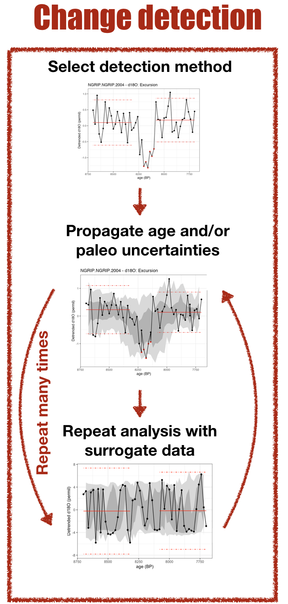

<!-- README.md is generated from README.Rmd. Please edit that file -->

# actR

<!-- badges: start -->

[](https://www.tidyverse.org/lifecycle/#experimental)
[](https://nsf.gov/awardsearch/showAward?AWD_ID=1929460)
[](https://www.belmontforum.org/archives/projects/abrupt-change-in-climate-and-ecosystems-where-are-the-tipping-points)
[](https://github.com/LinkedEarth/actR/actions)
[](https://zenodo.org/badge/latestdoi/359257314)
[](https://github.com/LinkedEarth/actR/actions/workflows/R-CMD-check.yaml)
<!-- badges: end -->

The goal of actR – the Abupt Change Toolkit in R – is to streamline
abrupt change detection, signficance testing, uncertainty quantification
and visualization for paleogeoscientific datasets. This project is
funded by the Belmont Forum as part of the “Abrupt Changes in Climate
and Ecosystems - Data & e-Infrastructure (ACCEDE)” project, as part of
the Science-driven e-Infrastructure Innovation program.

We’re still early in the development process, but basic functionality is
now available.

## actR Design and Philososphy

### Data input


actR, like most software, benefits greatly from standardized data
inputs. To achieve this, actR works best with LiPD data, although users
can also directly input data as matrices or vectors and metadata in R.
Either way, the inputs are passed through the `prepareInput()` function,
which helps to standardize the input for subsequent analysis, and
includes options for simple data preprocessing for methods as needed.

### Change detection - single site



actR equips single site, time series based change detection with error
propagation and robust null hypothesis testing. Change detection
algorithms are often highly parametric, and don’t consider many
uncertainties that are relevant to paleogeoscientific data. There are
two key processes to achieve this.

The first is handled by `propagateUncertainty()`, which will take age
and/or paleo (i.e., y-axis) uncertainties, and propagate through the
analysis using an ensemble approach. Age and/or paleo ensembles can be
entered directly into actR (this is typically preferred when possible),
or generated internally if desired.

The second, is robust null hypothesis testing, using the function
`testNullHypothesis()`, which generates surrogate data based on the
characteristics of the input data, and the repeats the entire analysis
(including error propagation) many times. This lets the user assess how
plausible surrogate data perform given the data, algorithm, and
parametric choices, and determine whether any detected changes are
robust to those sources of uncertainty and bias.

For an example of how this proceess works, [check out this
example](articles/detectExcursion.html).

### Change detection - multi site / geospatial

This is planned, but still in progress.

### Results


All change detection methods implemented in actR have two output
options, `summary()` (and `print()`), which provides a text summary of
the test conducted and the results, and `plot()` which visualizes the
results, including both error propagation and null hypothesis testing.
Other approaches, including geospatial change detection, will include
additional outputs as appropriate.

## Contributor guide

We’re ready for interested people to start contributing Abrupt Change
methods to actR! [Check out the Contribrutor’s
Guide!](contributor_guide.html)

## Installation

You can install the development version from
[GitHub](https://github.com/) with:

``` r
# install.packages("remotes")
remotes::install_github("LinkedEarth/actR")
```
